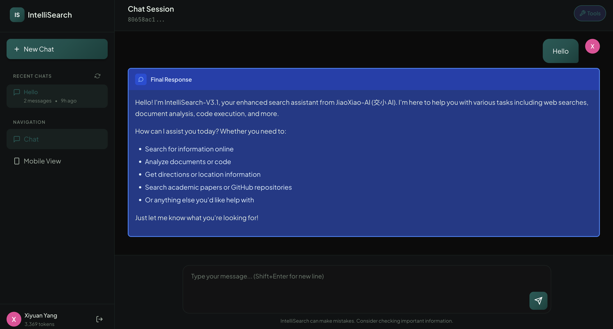

<p align="center">
  <picture>
    <source media="(prefers-color-scheme: dark)" srcset="https://img.shields.io/badge/MineIntel-AutoClaw-0a0f12?style=for-the-badge&logo=data:image/svg+xml;base64,PHN2ZyB4bWxucz0iaHR0cDovL3d3dy53My5vcmcvMjAwMC9zdmciIHdpZHRoPSIyNCIgaGVpZ2h0PSIyNCIgdmlld0JveD0iMCAwIDI0IDI0IiBmaWxsPSJub25lIiBzdHJva2U9IiMzNGI3YTAiIHN0cm9rZS13aWR0aD0iMiI+PHBhdGggZD0iTTIgMjJoMjBWMkgydjIweiIvPjxwYXRoIGQ9Ik0xMiAyVjIyIi8+PHBhdGggZD0iTTIgMTJoMjAiLz48L3N2Zz4=&logoColor=34b7a0&labelColor=0a0f12&color=34b7a0">
    
  </picture>
</p>

<h1 align="center">MineIntel-AutoClaw</h1>

<h3 align="center">基于多智能体的科创孵化助手</h3>

<p align="center">
  <em>Multi-Agent Based Sci-Tech Innovation Incubation Assistant</em>
</p>

<p align="center">
  <a href="https://github.com/Richard110206/MineIntel-Autoclaw">
    
  </a>
  
  
  
  <br>
  
  
  
  
</p>

<p align="center">
  
  
  
  
</p>

---

## Award

> **2026 年（第 21 届）中国大学生计算机设计大赛 — 智能体专项赛 江苏省一等奖**
>
> 2026 Chinese Collegiate Computing Competition (CCDC) — Intelligent Agent Special Track, Jiangsu Province **First Prize**

---

## Overview

**MineIntel-AutoClaw (矿小智)** 是一个基于多智能体协作的科创孵化助手，面向矿井/矿业场景提供端到端科研调研服务，基于 [AutoClaw](https://github.com/zhipu-ai/autoclaw) 原生 Skill 架构构建。它通过 7 个协作专家角色的多步编排，自动完成从场景分析、知识图谱检索、论文线索整理、Baseline 推荐到导师匹配的全链路科研调研，最终交付 HTML 完整报告与 LaTeX/PDF 文献综述。

> **English:** MineIntel-AutoClaw is a multi-agent based sci-tech innovation incubation assistant built on AutoClaw's native Skill architecture. It orchestrates 7 collaborative expert roles to automate the full research pipeline — from scene analysis and knowledge graph retrieval to paper search, baseline recommendation, and advisor matching — delivering polished HTML reports and LaTeX/PDF literature reviews.

---

## Architecture

```
┌─────────────────────────────────────────────────────────────────┐
│                    MineIntel-AutoClaw-Skill                      │
│                       (矿小智 总入口)                              │
├─────────────────────────────────────────────────────────────────┤
│                                                                  │
│  ┌─────────────────── mineintel-research ───────────────────┐   │
│  │                 (主控闭环 Skill)                           │   │
│  │                                                          │   │
│  │   ┌──────────┐  ┌──────────┐  ┌──────────────────────┐  │   │
│  │   │ Step 1   │→ │ Step 2   │→ │ Step 3               │  │   │
│  │   │ 任务理解  │  │ 知识图谱  │  │ 中文应用论文检索      │  │   │
│  │   └──────────┘  └──────────┘  └──────────┬───────────┘  │   │
│  │                                              │            │   │
│  │   ┌──────────────────────┐  ┌──────────┐    │            │   │
│  │   │ Step 6   经验参考     │  │ Step 5   │    │            │   │
│  │   │ 知乎/小红书           │← │ 导师匹配  │←   │            │   │
│  │   └──────────┬───────────┘  └──────────┘    │            │   │
│  │              ↓                               │            │   │
│  │   ┌──────────────────────┐  ┌──────────┐    │            │   │
│  │   │ Step 7   报告交付     │← │ Step 4   │←───┘            │   │
│  │   │ HTML / LaTeX / PDF   │  │ 国际前沿   │                 │   │
│  │   └──────────────────────┘  │ + Baseline │                 │   │
│  │                              └──────────┘                  │   │
│  └──────────────────────────────────────────────────────────┘   │
│                                                                  │
│  ┌─────────────┐  ┌────────────┐  ┌─────────────────────────┐  │
│  │ Knowledge   │  │ Literature │  │ HTML Poster & LaTeX      │  │
│  │ Graph       │  │ MCP Server │  │ Report Engine            │  │
│  │ 知识图谱     │  │ MCP 检索   │  │ 报告生成引擎              │  │
│  └─────────────┘  └────────────┘  └─────────────────────────┘  │
│                                                                  │
│  ┌───────────────────────────────────────────────────────────┐  │
│  │               Real-time Progress UI (demo-ui)              │  │
│  └───────────────────────────────────────────────────────────┘  │
└─────────────────────────────────────────────────────────────────┘
```

---

## Feature Highlights

<table>
<tr>
<td width="50%">

### Knowledge Graph
基于白皮书、蓝皮书、政策标准和人工场景表构建的矿井应用知识图谱，支持 **场景 → 痛点 → 解决方案 → 技术设备 → 来源依据** 的结构化检索与溯源。

</td>
<td width="50%">

### Multi-Agent Orchestration
7 个协作专家角色按序编排：矿井应用专家 → 领域分析师 → 行业前沿专家 → Baseline 专家 → 导师申报专家 → 经验参考专家 → 总报告专家。

</td>
</tr>
<tr>
<td width="50%">

### Literature Search
内置 MCP Server，支持中文矿业期刊（煤炭学报、工矿自动化等）和国际前沿（arXiv、IEEE、MDPI）论文线索检索，MCP 不可用时自动脚本兜底。

</td>
<td width="50%">

### Advisor Matching
自动检索中国矿业大学各学院官网师资页面，匹配研究方向相关的导师，给出姓名、学院和官网链接。

</td>
</tr>
<tr>
<td width="50%">

### Report Generation
自动生成 **HTML 完整报告**（magazine-poster 风格）和 **LaTeX/PDF 文献综述**，包含研究主题、场景分析、论文线索、技术路线等完整内容。

</td>
<td width="50%">

### Real-time Progress UI
调研过程中实时同步进度到 Web 页面，展示当前阶段、思考过程、工具调用状态和完成百分比。

</td>
</tr>
</table>

---

## Skill Structure

| Skill | Description | Key Capability |
|:------|:------------|:---------------|
| `mineintel-research` | 主控闭环 Skill | 端到端任务编排，7 步流水线调度 |
| `mineintel-application-kg` | 矿井应用知识图谱 | 场景-痛点-解决方案结构化检索 |
| `mineintel-knowledge-rag` | 本地知识库与导师匹配 | RAG 检索 + 官网导师推荐 |
| `mineintel-literature-baseline` | 论文线索与 Baseline | MCP 工具 + 中英文论文检索 |
| `mineintel-experience-insights` | 科研经验参考 | 知乎/小红书经验提炼 |
| `mineintel-report-export` | 报告交付编排 | HTML + LaTeX/PDF 导出 |
| `mineintel-html-poster` | HTML 海报报告 | Magazine-poster 风格渲染 |
| `mineintel-literature-review` | 文献综述生成 | LaTeX 结构化综述 + PDF 编译 |

---

## Quick Start

### Prerequisites

- [AutoClaw](https://github.com/zhipu-ai/autoclaw) Desktop App
- Python 3.x
- (可选) XeLaTeX — 用于 PDF 编译

### Installation

```bash
# 1. Clone the repository
git clone git@github.com:Richard110206/MineIntel-Autoclaw.git

# 2. 将整个 MineIntel-AutoClaw-Skill 文件夹导入 AutoClaw 作为 Skill 组
#    拖入 AutoClaw Skills 目录即可自动识别

# 3. (可选) 如果 AutoClaw 支持 MCP 注册，配置文献检索 MCP Server:
#    参见 MineIntel-AutoClaw-Skill/mineintel-literature-baseline/mcp_servers/mcp_config.json
```

### Usage

在 AutoClaw 中发送以下提示词即可触发完整的科研调研流程：

```
请使用 MineIntel-AutoClaw-Skill（矿小智）技能组，围绕"计算机视觉在矿井安全监测中的大创选题"生成科研调研报告。
我的专业是软件工程。
我想研究的技术领域是计算机视觉。
矿业场景是矿井安全监测。
```

输出将保存到 `output/<时间戳_报告标题>/` 目录：

| File | Description |
|:-----|:------------|
| `<标题>_poster.html` | HTML 完整报告 (magazine-poster 风格) |
| `<标题>_literature_review.tex` | 文献综述 LaTeX 源码 |
| `<标题>_literature_review.pdf` | 文献综述 PDF (需 XeLaTeX) |

---

## Tech Stack

<p>
  
  
  
  
  
</p>

---

## Data Sources

| Source | Type | Usage |
|:-------|:-----|:------|
| 煤矿智能化蓝皮书 (2025) | 白皮书 | 知识图谱构建 |
| 煤矿智能化建设指南 (2021) | 政策标准 | 场景依据 |
| 国家矿山安全监察局政策 | 政策文件 | 行业背景 |
| 5G 智慧矿山白皮书 | 行业白皮书 | 技术参考 |
| 华为/中兴/中国电信矿山方案 | 企业方案 | 技术路线 |
| ABB/Siemens/Schneider Mining | 国际方案 | 前沿对比 |
| 矿井场景总览 (20 场景) | 人工标注 | 高置信骨架 |

---

## Project Structure

```
MineIntel-AutoClaw-Skill/
├── SKILL.md                          # 总入口 Skill
├── README.txt                        # 提交说明
├── demo_prompts.txt                  # 演示提示词
│
├── mineintel-research/               # 主控闭环 Skill
│   ├── SKILL.md
│   ├── scripts/                      # 主控脚本
│   │   ├── progress_update.py
│   │   ├── start_progress_ui.py
│   │   ├── advisor_search.py
│   │   ├── paper_search.py
│   │   ├── github_search.py
│   │   └── ...
│   └── references/                   # 参考文档
│
├── mineintel-application-kg/         # 知识图谱 Skill
│   ├── SKILL.md
│   ├── scripts/
│   └── data/
│       ├── user_sources/             # 人工场景表
│       ├── raw_docs/                 # 原始文档 (30+)
│       ├── clean/                    # 清洗后语料
│       └── kg/                       # 知识图谱数据
│
├── mineintel-knowledge-rag/          # 知识库 Skill
├── mineintel-literature-baseline/    # 论文检索 Skill (含 MCP)
│   ├── mcp_servers/                  # MCP Server
│   └── scripts/
├── mineintel-experience-insights/    # 经验参考 Skill
├── mineintel-report-export/          # 报告导出 Skill
├── mineintel-html-poster/            # HTML 海报 Skill
├── mineintel-literature-review/      # 文献综述 Skill
│
├── demo-ui/                          # 实时进度 UI
│   ├── index.html
│   └── assets/
│
├── output/                           # 报告输出目录
└── tools/                            # 辅助工具
```

---

## Demo

<div align="center">

### Real-time Progress UI



*调研过程中的实时进度展示 — 矿业纪事报风格*

</div>

---

## Competition Info

| Item | Detail |
|:-----|:-------|
| **Competition** | 2026 年中国大学生计算机设计大赛 (CCDC) |
| **Track** | 智能体专项赛 (Intelligent Agent Special) |
| **Award** | 江苏省一等奖 (Jiangsu Province First Prize) |
| **Project** | MineIntel-AutoClaw (矿小智) |
| **Institution** | China University of Mining and Technology |

---

## Team

<p align="center">
  <a href="https://github.com/Richard110206">
    
  </a>
</p>

---

## License

This project is licensed under the MIT License.

---

<p align="center">
  <sub>Built with</sub>
  
  
  <br>
  <sub>MineIntel-AutoClaw &copy; 2026 — 2026 CCDC Intelligent Agent Track, Jiangsu First Prize</sub>
</p>
